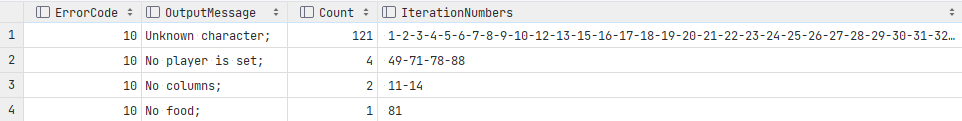

# Pseudocode

## Fuzz 1: Manual random testing with binary files and correct action sequence


*Context:*
In this stage, the maps are binary with a normal maximum size. The bytes are chosen randomly. The name of the map file
is normal. We will randomly choose bytes with the [`RandomBinaryMapGenerator.generateRandomMap()`](src/main/java/randomGenerators/map/RandomBinaryMapGenerator.java) method.
The action sequence will exist out of 5 characters (randomly chosen out the valid options E, S, U, D, Q, W, L and R). It
will have a normal name.

*Configs:*
Configure the [`Configuration.properties`](configs/Configuration.properties) file as followed: 
- typeFile=bin
- maxIterations=1000
- maxTime=900000

*Results:*
The results are stored in the [`fuzz1_binary`](fuzzresults_lessons/fuzz1_binary) directory. Putting the typeFile=bin in configs and
running the Fuzz class would give u something like shown in the above figure.
Open the binary files in a binary editor like [HxD](https://mh-nexus.de/en/hxd/) to see for yourself.

We can see that if the binary file has multiple lines, we get an Error reading file by readAllLines.
If the binary file has one line, the program JPacman starts to read the line.
If the line contains characters that are not valid, it will give another error message.
We know from the given assignment text, that a text file can have multiple lines in it and still be read.

```
if(file has multiple lines)
    if(file is not a text file)
        reject(Error reading file by readAllLines)
if(file has one line) 
    if(file is not a text file)
        if(file is binary file)
            if(line is not a a valid character)
                reject(unknown character)
            if(line is valid character)
                ?
        ?
     ?
if(file has no lines)
    if(file is a binary file)
        reject(no lines)       
```

## Fuzz 2: File content ~ Known ASCII characters



*Context:*
If I want to know if one-line binary files can be valid, I first need to know what the valid characters are. Let's make
a text map that always includes one of the 128 characters of the ASCII range.
We do this by using the method [`RandomTextMapGenerator.generateCustomTextMap(String mapLine)`](src/main/java/randomGenerators/map/RandomTextMapGenerator.java). The name of the map
file is normal.
The action sequence will exist out of 3 valid characters in a valid sequence: Start (S) - Wait (W) - Exit (E). The name
of the string will be normal.

*Configs:*
Configure the [`Configuration.properties`](configs/Configuration.properties) file as followed:
- customMapsNr=1
- customMSequenceNr=1
- typeFile=all
- maxIterations=128
- maxTime=90000

*Results:*
The results are stored in the [`fuzz2_knownCharacters`](fuzzresults_lessons/fuzz2_knownCharacters) directory. A summary of the results is shown in
the above figure. If it is a valid file and not an empty one, look at the characters inside.
If they are all valid character, look at the presence of all the needed characters. Note also that we did not test for
other alphabets or characters outside the ASCII range (e.g. Not all characters from UNICODE such as emoji's).

```
if (the file is not valid)
    reject(Error reading file by readAllLines)
if(the map does not contain valid characters (M, W, F, P))
    reject(unknown character)
if(the map does not contain character P)
    reject(no player is set)
if(the map does not contain character F)
    reject(no food is set)
```

## Fuzz 3: Valid (binary) file types

*Context:*
We still use all valid action sequence strings, since we are focussing on the map file first.
- We want to know if we can have a binary file type of one line that is valid. Therefore, test multiple and single
  character file type encoding with valid string -> Should get error no player of food instead of Error reading file by
  readAllLines
- If one-line binary files are valid, are there other file types that can only have one-line? Let's add some
  single-lined .map, .dat, .xml, .html, .xlsx, .pdf, and .csv files. Use Excel and IntelJI idea to create those files.
- Are multiple line text files valid? Are there other file types that can have multiple lines? Let's add some
  multi-lined .map, .dat, .xml, .html, .xlsx, .pdf, and .csv files. Use Excel and IntelJI idea to create those files.
- Are there other restrictions to file types?
  - File compression: Let's add a .txt file, but as a compressed .zip file. Use your operating system.
  - File permission: Let's add a .map file with no , read-only and write-only permission. Try to input a hidden file.
    Use your operating system.
  - File encryption: Let's add another encrypting algorithm, such as AES with a password. Use tools such
    as [Veracrypt](https://veracrypt.fr/en/Downloads.html).
  - File corruption: Add a file with an invalid extension (.corrupted for example) or change the encoding of a text file
    from UTF-8 to UTF-16 for example. Use programs like Notepad++ to do so.
  - File size: Let's add an empty and a massive .txt file. Use sites such as https://www.dummytextgenerator.com/
    or https://archive.random.org/text, or do this via the command
    line (, https://www.windows-commandline.com/how-to-create-large-dummy-file/#:~:text=echo%20%22This%20is%20just%20a%20sample%20line%20appended,a%201%20MB%20file%20dummy.txt%20within%20few%20seconds).
  - File name: Let's add am emtpy and a massive name. Let's add special characters (space, @, mixed alphabets) in the
    name.

If u want to use my custom_maps, copy the file in the maps directory of the fuzz3_filetypes (program will move them
while executing the fuzzer). If u copy-paste the files to maps, make sure to reconfigure permissions files (otherwise will be accepted).
for none permissions -> move copy read and reconfigure

Make sure to run afterwards with none of the files open, otherwise error because they can't move certain files (e.g., the encoded)

Configs:

- customMapsNr=3
- customSequenceNr=1
- maxBinaryMapSize = 5000
- maxTextMapHeight= 100
- maxTextMapWidth= 100
- maxIterations=37

Results:
We are going to have to put the file without permissions out of the list because it gives an error in the fuzzer. The
same happens with the Encrypted file! -> nog eens checken, niet zeker, was nu rejected

For the first time, the program accepted some files!

- The program accepted the multiple map files, even if they were only read-only or write-only.
- The program rejected the single-lined bin files (one or more characters) with the error messages about the players or
  food, meaning that it sees them as valid files. Otherwise, he would give the other file error message first.
- The program accepted multi-line text files, even if they had a file name that included other alphabets, spaces or
  special characters or if they were hidden.
- The program rejected the massive text files, but only because it had unknown characters in it.

Some rejected file types were:

- No permissions or encrypted files could not even be entered in the terminal.
- Error message "Error reading file by ReadAllLines": compressed or encrypted files, pdf or Excel files, multi-line
  binary files.
- Error message "No lines": The empty file.
- Error message "Unknown character": all csv files, and binary or .dat files that have multiple lines.

```
if(file not encrypted or no read or write permission)
  cannot do input in terminal
if(file is compressed, not encoded with UTF-8, or from an invalid data type (pdf, excel or multi-line binary))
  reject(Error reading file by ReadAllLines) 
if(file is empty)
  reject(No lines)
if(file is .csv, or multi-line .dat)
if(the map does not contain valid characters (M, W, F, P))
    reject(unknown character)
if(the map does not contain character P)
    reject(no player is set)
if(the map does not contain character F)
    reject(no food is set)
else
  accept
```

## Fuzz 4: File content ~ No player set, no food, map form

Context:

- If we have valid file types and valid characters, what happens if we add a player and food?
- Which sequences of maps are allowed? Which forms of match are allowed?

Configs:

- customMapsNr=4
- customSequenceNr=1
- maxIterations=1000
- maxTextMapHeight= 100
- maxTextMapWidth= 100
- fileType=txt

Results:

- If the map is not squared,
- If there is no player or multiple players
- If there is just one player, but no food

```
if(file not encrypted or no read or write permission)
  cannot do input in terminal
if(file is compressed, not encoded with UTF-8, or from an invalid data type (pdf, excel or multi-line binary))
  reject(Error reading file by ReadAllLines) 
if(file is empty)
  reject(No lines)
  reject(No columns)
if(file is .csv, or multi-line .dat)
if(the map does not contain valid characters (M, W, F, P))
    reject(unknown character)
if(the map does not contain character P)
    reject(no player is set)
if(the map contains multiple characters P)
    reject(more than one player)
if(the map does not contain character F)
    reject(no food is set)
else
  accept
```

## Fuzz 5: Action sequence strings

Context:

- Which sequences are allowed?

Configs:

- customMapsNr=5
- customSequenceNr=2
- maxIterations=1000
- maxBinaryMapSize = 5000
- maxTextMapHeight= 100
- maxTextMapWidth= 100
- fileType=txt

## Fuzz 6: Mutation-based
